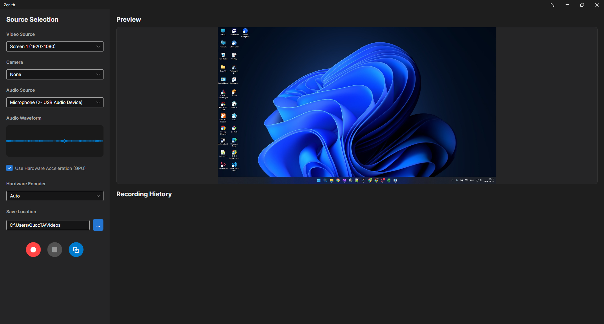

# Zenith

Zenith is a modern, cross-platform screen recording application built with Avalonia UI and .NET 10. It utilizes FFmpeg for high-performance video encoding.



## Features
- **Cross-Platform UI:** Sleek and modern user interface powered by Avalonia UI.
- **Hardware Capture:** Efficient desktop coordinate mapping for precise capture.
- **Region Select:** Click and drag to capture a custom screen region seamlessly.
- **Floating Widget:** Convenient mini-player widget for quick controls during recording.
- **Audio Capture:** Real-time waveform visualization.

## Architecture
All projects reside under the `src/` directory:
- `src/Zenith.Core`: Core domain models and interfaces.
- `src/Zenith.Data`: Local database integration (SQLite) for recording history.
- `src/Zenith.Interop`: Platform-specific integrations, C++ native source enumeration library, and FFmpeg engine wrappers.
- `src/Zenith.UI`: The main Avalonia UI application.
- `src/TestFfmpegApp` / `src/TestRunner`: Test utilities and runners.

## Installation
Currently, Zenith is in active development. Once stable releases are available, you will be able to install it by following these steps:

1. Navigate to the [Releases](#) page of this repository.
2. Download the latest `.zip` or installer file for your operating system (Windows, macOS, or Linux).
3. Extract the downloaded file to a folder of your choice.
4. Run the `Zenith.exe` (Windows) or the Zenith application file (macOS/Linux) to start recording!

*Note: You may need to have [FFmpeg](https://ffmpeg.org/download.html) installed on your system if it is not bundled with the application.*

## For Developers
Ensure you have the .NET 10 SDK installed.

1. Clone the repository.
2. Open `src/Zenith.slnx` in your preferred IDE (Visual Studio, Rider, VS Code).
3. Set `Zenith.UI` as the startup project.
4. Run the application!

## Building for Production

To build standalone executables for different operating systems, use the `.NET CLI` from the root of the repository:

### Windows (x64)
```bash
dotnet publish src/Zenith.UI/Zenith.UI.csproj -c Release -r win-x64 --self-contained true -p:PublishSingleFile=true
```

### macOS
For Intel Macs (x64):
```bash
dotnet publish src/Zenith.UI/Zenith.UI.csproj -c Release -r osx-x64 --self-contained true -p:PublishSingleFile=true
```
For Apple Silicon (ARM64):
```bash
dotnet publish src/Zenith.UI/Zenith.UI.csproj -c Release -r osx-arm64 --self-contained true -p:PublishSingleFile=true
```

### Linux (Ubuntu, Fedora, etc.)
```bash
dotnet publish src/Zenith.UI/Zenith.UI.csproj -c Release -r linux-x64 --self-contained true -p:PublishSingleFile=true
```
*Note for Linux users: You may need to install standard Avalonia dependencies (like libX11, GTK) depending on your distro.*

## Dependencies
- Avalonia UI (v12)
- FFmpeg (must be available in PATH or packaged with the app)
- System.Data.SQLite

## License
MIT
