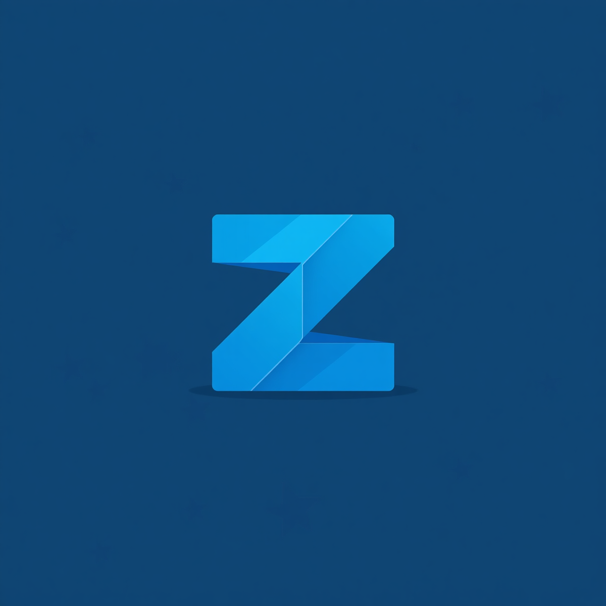

# 🌌 Zenith

<p align="center">
  
</p>

<p align="center">
  <strong>The ultimate, lightweight, and incredibly powerful screen recorder for everyone.</strong>
</p>

<p align="center">
  
  
  
  
</p>

---

## 👋 Welcome to Zenith!

Are you looking for a simple, fast, and professional way to record your screen, gameplay, or tutorials? **Zenith** is here for you. Built from the ground up to be lightweight and fast, Zenith gives you the power of professional broadcasting software in an easy-to-use package.


## ✨ Why Choose Zenith?

- **🎥 Multi-Source Recording:** Mix multiple video sources at once! Record your whole screen, a specific window, your webcam, or overlay images seamlessly.
- **🎚️ Pro Audio Mixer:** Balance your microphone and system audio with our professional, OBS-style multi-track audio mixer. See your sound levels in real-time!
- **🚀 Lightning Fast:** Zenith is hardware-accelerated. That means it uses your graphics card to record, keeping your computer running smoothly without lag.
- **✂️ Custom Regions:** Only want to record a specific part of your screen? Just click and drag to select your recording area.
- **📱 Floating Widget:** A tiny, unobtrusive control widget stays on your screen so you can pause or stop recording without opening the main app.
- **💾 Auto-History:** Never lose a recording. Zenith keeps a neat history of all your saved videos right inside the app.

---

## 📥 How to Install

Getting started with Zenith is incredibly easy. No complex setups required!

1. Go to the [Releases](#) page of this repository.
2. Download the installer for your computer:
   - **Windows:** Download the `.exe` or `.zip` file.
   - **macOS:** Download the `.dmg` file.
   - **Linux:** Download the AppImage or `.tar.gz`.
3. Extract the file (if needed) and double-click **Zenith** to open it!

*Note: Zenith comes pre-packaged with everything you need. You don't need to install any extra software to start recording!*

---

## 🎮 Quick Start Guide

Ready to make your first recording? Just follow these 3 simple steps:

1. **Add Your Sources:** 
   Click the **`+`** button under "Sources" to add what you want to see (like your Screen or Webcam).
2. **Check Your Audio:** 
   Speak into your microphone or play some music. Watch the **Audio Mixer** bars bounce and adjust the volume sliders to your liking.
3. **Hit Record!** 
   Press the big red **Record** button at the top. When you're done, press **Stop**, and your video is instantly saved and ready to share!

---
---

<br/>

## 🛠️ For Developers & Tech Enthusiasts

Zenith is a modern, cross-platform application built with **Avalonia UI** and **.NET 10**, utilizing **FFmpeg** for high-performance video encoding.

### Architecture
All projects reside under the `src/` directory:
- `src/Zenith.Core`: Core domain models and interfaces.
- `src/Zenith.Data`: Local database integration (SQLite) for recording history.
- `src/Zenith.Interop`: Platform-specific integrations, C++ native source enumeration library, and FFmpeg engine wrappers.
- `src/Zenith.UI`: The main Avalonia UI application.

### Building from Source
Ensure you have the .NET 10 SDK installed.

1. Clone the repository.
2. Download FFmpeg shared libraries (auto-downloads on first build, or run manually):
   ```bash
   # Windows (PowerShell)
   .\scripts\download-ffmpeg.ps1

   # Linux/macOS
   ./scripts/download-ffmpeg.sh
   ```
3. Open `src/Zenith.slnx` in your preferred IDE (Visual Studio, Rider, VS Code).
4. Set `Zenith.UI` as the startup project and run!

### Building for Production
To build standalone executables, use the `.NET CLI` from the root directory:

**Windows (x64)**
```bash
dotnet publish src/Zenith.UI/Zenith.UI.csproj -c Release -r win-x64 --self-contained true -p:PublishSingleFile=true
```

**macOS (Intel / ARM64)**
```bash
dotnet publish src/Zenith.UI/Zenith.UI.csproj -c Release -r osx-arm64 --self-contained true -p:PublishSingleFile=true
```

**Linux (x64)**
```bash
dotnet publish src/Zenith.UI/Zenith.UI.csproj -c Release -r linux-x64 --self-contained true -p:PublishSingleFile=true
```

### Dependencies
- Avalonia UI (v12)
- FFmpeg (FFmpeg.AutoGen)
- System.Data.SQLite

## 📜 License
This project is licensed under the MIT License. See the [LICENSE](LICENSE) file for details.
