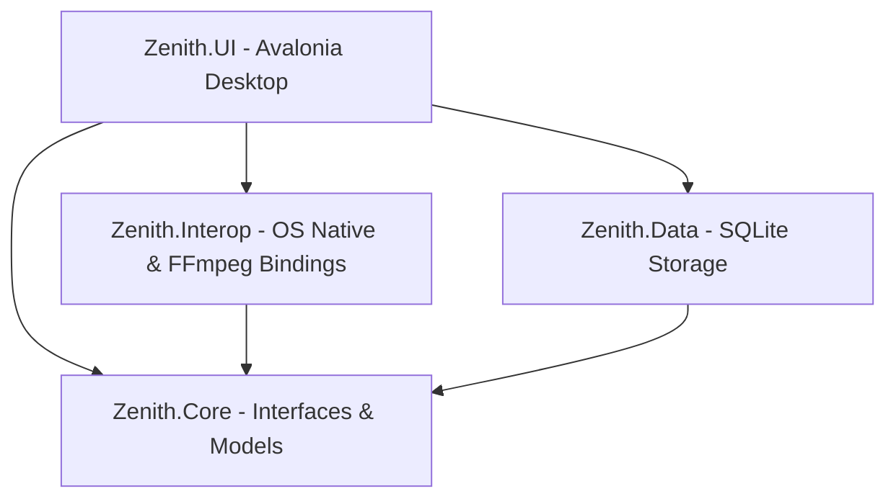
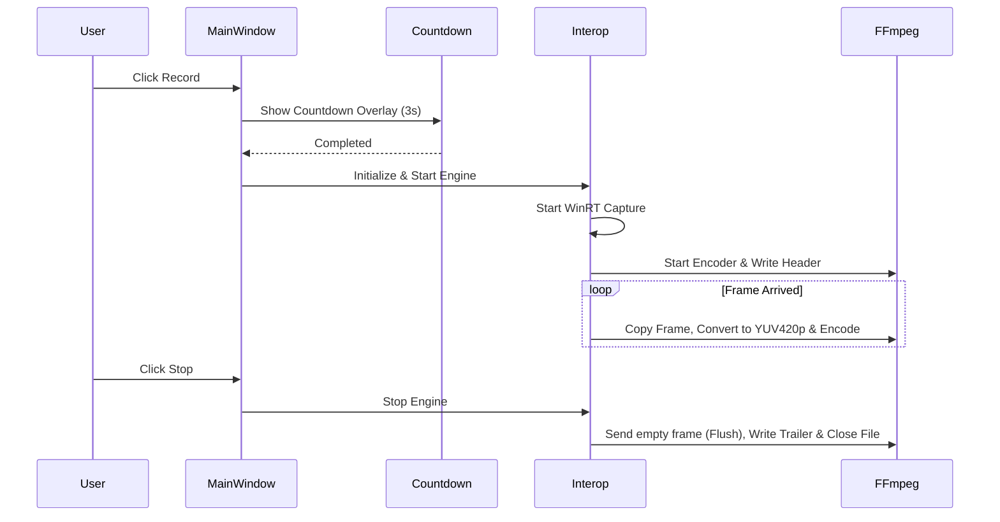

# Kiến trúc & Cấu trúc Thư mục Zenith Screen Recorder

Tài liệu này mô tả chi tiết kiến trúc hệ thống, cấu trúc thư mục và các luồng xử lý chính của ứng dụng quay màn hình **Zenith Screen Recorder**.

---

## 1. Tổng quan Kiến trúc (Architectural Overview)

Zenith được thiết kế theo kiến trúc phân lớp (Layered Architecture) kết hợp với mô hình Modular nhằm đảm bảo tính tái sử dụng mã nguồn và khả năng hỗ trợ đa nền tảng (Windows, Linux, macOS) trong tương lai.



### Các lớp chính trong hệ thống:
*   **Zenith.UI (Presentation Layer)**: Giao diện người dùng viết bằng Avalonia UI framework, hỗ trợ chạy mượt mà trên đa nền tảng và cung cấp giao diện hiển thị dạng cửa sổ chính (MainWindow) hoặc thanh công cụ mini (RecordingWidget).
*   **Zenith.Core (Abstractions Layer)**: Định nghĩa các Interface cốt lõi, Enums, Models dùng chung. Lớp này hoàn toàn thuần .NET (.NET Standard/Core) và không phụ thuộc vào bất kỳ thư viện OS native nào.
*   **Zenith.Interop (Infrastructure/OS Interop Layer)**: Chứa các phần hiện thực (implementations) phụ thuộc nền tảng hoặc thư viện native (như FFmpeg, Windows Graphics Capture, Vortice.Direct3D11, NAudio).
*   **Zenith.Data (Data Access Layer)**: Quản lý cơ sở dữ liệu SQLite cục bộ thông qua Dapper để lưu trữ lịch sử các bản ghi hình (Recording History).

---

## 2. Chi tiết Cấu trúc Thư mục (Folder Structure)

```text
Zenith/
│
├── docs/                      # Tài liệu dự án
│   ├── architecture.md        # Tài liệu kiến trúc hiện tại
│   └── ffmpeg_compliance.md   # Tài liệu tương thích FFmpeg
│
├── lib/                       # Thư viện và thư mục chứa binary phụ thuộc
│   └── ffmpeg/                # Bộ thư viện DLLs FFmpeg phiên bản Master/v63+
│
├── Zenith.Core/               # Lớp Abstractions chính
│   ├── IDeviceEnumerator.cs   # Interface liệt kê màn hình/camera/audio
│   ├── IHotkeyService.cs      # Interface đăng ký phím tắt hệ thống
│   ├── IPermissionService.cs  # Interface kiểm tra quyền truy cập thiết bị
│   ├── IRecorderEngine.cs     # Interface điều khiển Engine quay màn hình
│   └── MockRecorderEngine.cs  # Engine giả lập phục vụ debug/testing
│
├── Zenith.Data/               # Lớp truy cập Cơ sở dữ liệu
│   ├── Record.cs              # Entity định nghĩa bản ghi (History Item)
│   ├── RecordRepository.cs    # Repository tương tác SQLite sử dụng Dapper
│   └── Zenith.Data.csproj
│
├── Zenith.Interop/            # Lớp chứa triển khai Native APIs & FFmpeg
│   ├── AudioCaptureEngine.cs  # Hiện thực thu âm qua NAudio
│   ├── FFmpegRecorderEngine.cs# Engine ghi màn hình bằng WinRT Capture & FFmpeg
│   ├── WindowsDeviceEnumerator.cs # Liệt kê thiết bị Windows qua DXGI & WMI
│   ├── WindowsHotkeyService.cs    # Đăng ký phím tắt Windows (RegisterHotKey)
│   ├── PermissionServices.cs      # Kiểm tra quyền trên Windows
│   └── Zenith.Interop.csproj
│
├── Zenith.UI/                 # Giao diện Avalonia UI App
│   ├── Assets/                # Tài nguyên hình ảnh, biểu tượng (icon)
│   ├── App.axaml              # Định nghĩa Application, Styles và Themes
│   ├── MainWindow.axaml       # Giao diện chính của ứng dụng
│   ├── RecordingWidget.axaml  # Thanh điều khiển nhỏ khi đang quay (Widget)
│   ├── CountdownOverlay.axaml # Lớp phủ đếm ngược 3-2-1 trước khi quay
│   └── RegionSelectOverlay.axaml # Giao diện chọn vùng màn hình cần quay
│
├── Zenith.PoC.Windows/        # Proof of Concept riêng cho các tính năng Windows
├── Zenith.PoC.Linux/          # Proof of Concept cho Linux (X11/Wayland)
├── Zenith.PoC.macOS/          # Proof of Concept cho macOS (AVFoundation)
├── TestRunner/                # Console Application dùng để test độc lập Interop
└── Zenith.slnx                # File Solution của Visual Studio
```

---

## 3. Các Luồng Xử Lý Chính (Key Workflows)

### A. Luồng Đếm Ngược & Ghi Hình (Countdown & Recording Workflow)

Khi người dùng nhấn nút **Record**:

1.  **Tính toán Vùng quay & Màn hình**: `MainWindow` xác định khu vực cần ghi hình. Nếu chọn cụ thể màn hình (ví dụ Screen 2), tọa độ gốc và Handle của màn hình (`HMONITOR`) sẽ được lấy ra qua `MonitorFromPoint`.
2.  **Kích hoạt Countdown**: Cửa sổ `CountdownOverlay` được tạo ra, căn giữa khu vực được quay và hiển thị đếm ngược từ 3 về 1. Luồng chạy của `RecordButton_Click` sẽ được tạm dừng cho đến khi đếm ngược hoàn tất.
3.  **Khởi tạo FFmpeg Context**: `FFmpegRecorderEngine` khởi tạo bộ giải mã H264 (`libx264`), tệp chứa MP4 (`AVFormatContext`) và thiết lập các thông số về khung hình (Width, Height, Framerate).
4.  **Bắt đầu Capture (Windows Graphics Capture)**: Tạo luồng free-threaded để bắt khung hình từ card đồ họa qua `Direct3D11CaptureFramePool`. Khung hình gốc nhận được ở định dạng màu BGRA.
5.  **Vòng lặp Mã hóa (Encoding Loop)**:
    *   Sự kiện `FrameArrived` bắt các khung hình GPU và đẩy chúng vào hàng đợi chặn (`BlockingCollection<Direct3D11CaptureFrame>`).
    *   Luồng phụ chạy `EncodeLoop` sẽ lấy các khung hình ra, thực hiện copy pixel qua texture trung gian (`_stagingTexture`), scale và chuyển hệ màu sang `YUV420P` bằng `sws_scale`, rồi đẩy vào encoder để ghi xuống file MP4.
6.  **Ghi Đuôi & Đóng File**: Khi dừng, file video được hoàn thiện đầy đủ cấu trúc MP4 (Trailer, SPS/PPS Header) và đóng an toàn.



---

## 4. Quản lý Tài nguyên Bộ nhớ & Đa Nền tảng

*   **Tương thích FFmpeg**: Sử dụng wrapper `FFmpeg.AutoGen` phối hợp ghi đè phiên bản thư viện động (`ffmpeg.LibraryVersionMap`) đảm bảo hoạt động tốt với các DLLs FFmpeg mới nhất (Master/v63+).
*   **Giải phóng bộ nhớ (Memory Management)**: Các con trỏ thô của FFmpeg (`AVFrame*`, `AVPacket*`, `AVFormatContext*`) và tài nguyên DirectX/COM (`ID3D11Texture2D`, `IDirect3DDevice`) được dọn dẹp cẩn thận trong các khối `finally` hoặc phương thức `Dispose` nhằm ngăn chặn rò rỉ bộ nhớ (memory leaks).
*   **Chiến lược Đa Nền tảng**:
    *   Hệ thống phân tách rõ ràng phần Native Interop.
    *   Trên **Windows**, sử dụng API độ trễ thấp `Windows.Graphics.Capture` (DirectX 11).
    *   Trên **Linux/macOS**, hệ thống có các thư mục PoC riêng để tích hợp các API tương ứng (X11/Wayland hoặc AVFoundation) mà không làm ảnh hưởng đến mã nguồn giao diện chung của ứng dụng.
