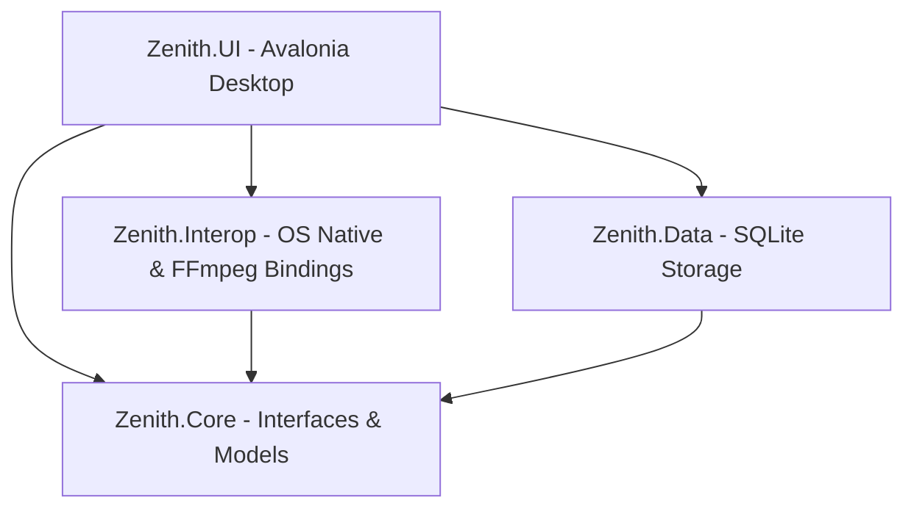
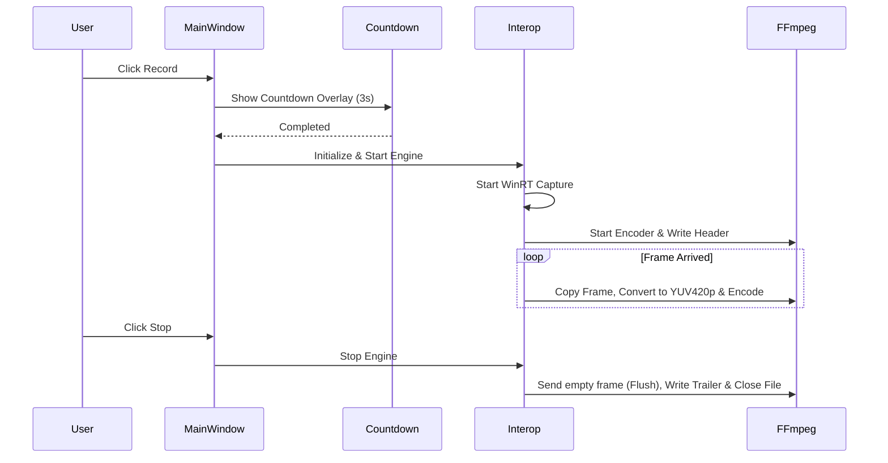

# Architecture & Folder Structure of Zenith Screen Recorder

This document describes in detail the system architecture, folder structure, and main processing workflows of the **Zenith Screen Recorder** application.

---

## 1. Architectural Overview

Zenith is designed using a Layered Architecture combined with a Modular approach to ensure code reusability and potential cross-platform support (Windows, Linux, macOS) in the future.



### Main System Layers:
*   **Zenith.UI (Presentation Layer)**: The user interface written with the Avalonia UI framework, providing smooth cross-platform capabilities and featuring both a main window (`MainWindow`) and a mini toolbar (`RecordingWidget`).
*   **Zenith.Core (Abstractions Layer)**: Defines core interfaces, enums, and shared models. This layer is pure .NET (.NET Standard/Core) and does not depend on any OS-native libraries.
*   **Zenith.Interop (Infrastructure/OS Interop Layer)**: Contains platform-dependent implementations and native libraries (such as FFmpeg, Windows Graphics Capture, Vortice.Direct3D11, and NAudio).
*   **Zenith.Data (Data Access Layer)**: Manages a local SQLite database using Dapper to store recording history (Recording History).

---

## 2. Folder Structure Detail

```text
Zenith/
│
├── docs/                      # Project documentation
│   ├── architecture.md        # Current architecture document
│   └── ffmpeg_compliance.md   # FFmpeg compatibility guidelines
│
├── lib/                       # Third-party native libraries
│   └── ffmpeg/                # FFmpeg native DLLs (Master/v63+ builds)
│
├── Zenith.Core/               # Abstractions Layer
│   ├── IDeviceEnumerator.cs   # Interface for enumerating displays/webcams/audio sources
│   ├── IHotkeyService.cs      # Interface for global hotkey registration
│   ├── IPermissionService.cs  # Interface for checking device permissions
│   ├── IRecorderEngine.cs     # Interface controlling the screen recorder engine
│   └── MockRecorderEngine.cs  # Mock engine for debugging/testing
│
├── Zenith.Data/               # Database Access Layer
│   ├── Record.cs              # History entry entity definition
│   ├── RecordRepository.cs    # Repository using SQLite with Dapper
│   └── Zenith.Data.csproj
│
├── Zenith.Interop/            # Native APIs & FFmpeg Interop Layer
│   ├── AudioCaptureEngine.cs  # Audio recording implementation via NAudio
│   ├── FFmpegRecorderEngine.cs# Screen recorder using WinRT Capture & FFmpeg
│   ├── WindowsDeviceEnumerator.cs # Enumerator for Windows via DXGI & WMI
│   ├── WindowsHotkeyService.cs    # Windows global hotkey hook (RegisterHotKey)
│   ├── PermissionServices.cs      # Windows permission checker
│   └── Zenith.Interop.csproj
│
├── Zenith.UI/                 # Avalonia UI App Presentation
│   ├── Assets/                # Local images and icons
│   ├── App.axaml              # Application configuration, styles, and themes
│   ├── MainWindow.axaml       # Primary application window
│   ├── RecordingWidget.axaml  # Floating mini toolbar during recording
│   ├── CountdownOverlay.axaml # 3-2-1 countdown screen overlay
│   └── RegionSelectOverlay.axaml # Overlay for selecting a custom capture region
│
├── Zenith.PoC.Windows/        # Proof of Concept for Windows-specific features
├── Zenith.PoC.Linux/          # Proof of Concept for Linux (X11/Wayland)
├── Zenith.PoC.macOS/          # Proof of Concept for macOS (AVFoundation)
├── TestRunner/                # Console application for isolated interop tests
└── Zenith.slnx                # Visual Studio Solution description file
```

---

## 3. Key Workflows

### A. Countdown & Recording Workflow

When a user clicks the **Record** button:

1.  **Coordinate & Screen Detection**: `MainWindow` determines the targeted capture boundaries. If a specific monitor is selected (e.g. Screen 2), its native handle (`HMONITOR`) is fetched via `MonitorFromPoint`.
2.  **Countdown Overlay**: The `CountdownOverlay` window is initialized, positioned at the center of the capture region, and displays a countdown from 3 to 1. The main execution thread of `RecordButton_Click` awaits this process.
3.  **FFmpeg Initialization**: `FFmpegRecorderEngine` initializes the H.264 codec (`libx264`), the MP4 file container format (`AVFormatContext`), and configures the video parameters (Width, Height, Framerate).
4.  **Capture Session Setup**: Creates a free-threaded frame pool using `Direct3D11CaptureFramePool` to retrieve native GPU textures from the selected screen.
5.  **Encoding Loop**:
    *   The `FrameArrived` callback captures GPU surfaces and enqueues them into a `BlockingCollection<Direct3D11CaptureFrame>`.
    *   A background task executing `EncodeLoop` retrieves the captured frames, copies texture data to a staging texture (`_stagingTexture`), converts color spaces to YUV420P using `sws_scale`, and feeds the frames to the FFmpeg encoder.
6.  **Trailer & Stream Closing**: Upon stopping, the remaining frames are flushed, the format trailer (containing metadata like the `moov` atom) is written to file, and all format context descriptors are safely released.



---

## 4. Memory Management & Multi-OS Compatibility Strategy

*   **FFmpeg Dynamic Version Binding**: Employs `FFmpeg.AutoGen` and configures `ffmpeg.LibraryVersionMap` dynamically to bind compatibility interfaces for the latest master builds of FFmpeg (v63+).
*   **Unmanaged Resource Disposal**: All unmanaged native contexts (`AVFrame*`, `AVPacket*`, `AVFormatContext*`) and DirectX resources (`ID3D11Texture2D`, `IDirect3DDevice`) are disposed within dedicated `finally` blocks and `Dispose` methods to prevent memory leaks.
*   **Cross-Platform Architecture**:
    *   Operating system-specific APIs are strictly encapsulated inside `Zenith.Interop`.
    *   On **Windows**, low-latency desktop capture utilizes `Windows.Graphics.Capture`.
    *   For **Linux** and **macOS**, modular placeholders in `PoC` projects allow integrating native display protocols (like X11/Wayland or AVFoundation) without modifying the common UI layer.
